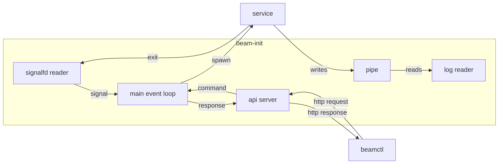

Beam-init uses the tokio async runtime. On this runtime, in addition to the main event loop, it runs two tasks that produce events on a channel:

* The signalfd reader: responsible for getting child exit (`SIGCHLD`) notifications.
* The API server: responsible for listening for HTTP requests on `/run/beam-init`.

The main event loop reads these events from the channel and updates the `ServiceManager` state as appropriate and takes any other necessary action like producing a response to an API request or spawning a process.

For every running service there is also a log reader instance which directly writes the logs to the `Logs` instance after reading them from the stdout/stderr pipe without going through the main event loop.

