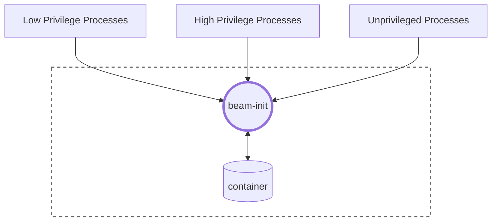

## Assets
The following assets are identified:

* Services
  - I.e. meaningful things that a beam instance can *do*.
* Containers
  - I.e. the resources that beam instances *use* to do things.

## Actors
The following actors are identified; we are deliberately ambiguous whether these are "users" or "processes".

* Highly privileged processes
  - I.e. the users that can configure and start beam instances and will have `root` privileges on them, and that "owns" the container it runs on; or the services that they delegate that power to.
    Typically these would be "customers of Teleport".
* Lesser privileged processes
  - I.e. services initiated by that client on a beam instance, that will most likely not run as `root`. Typically these would be "third parties", i.e. clients of the customers of teleports.
* Unprivileged processes
  - I.e. outside users/services that can influence the beam instance but have *no rights* on them (e.g. because the beam instance runs as server, or as a client consults an external resource).

## Actor-Asset-Action Matrix

Semantics:

* ✅ - Always allowed
* ❌ - Never allowed
* 🔓 - Allowed under conditions

For services we analysed the Create/Read/Update/Delete categories, for Containers we only looked at Read and Delete, since
creating and updating containers are out of scope.

|        | Services (C/R/U/D) | Containers (R/D)
|--------|--------------------|---------------------------
|High p. | ✅/✅/✅/✅       | ✅/✅
|Low p.  | 🔓/🔓/🔓/🔓       | 🔓/❌
|Unp.    | ❌/❌/❌/❌       | ❌/❌

The condition related to all 🔓 is:
- A process is allowed to perform the operations to the services that it *owns*, but not to other services.

## Simplified threat table

This table lists the risk associated with a user who is able to escalate their privilege (i.e. are not allowed to do the thing they're doing), as well as who experience a denial of service (i.e. is not allowed to do a thing they should be allowed to do).

|                    | EoP     | DoS     |
|--------------------|---------|---------|
| Services (C/R/U/D) | 🔴Hi/🟡Md/🔴Hi/🟡Md | 🟢Lo/🟢Lo/🟡Md/🟡Md |
| Containers (R/D)   | 🟢Lw/🟡Md     | 🟢Lw/🟡Md      |

## Mitigations

There are two risks classified as High, that we'll look at as one:

* Creating/Updating a service that one is not permitted to do
  - Mitigation: for unprivileged users, this should be prevented in its entirety
  - Mitigation: for low privileged users, this should be *thwarted* (by having simple access controls)
 
Most risks are medium:

* A user reading (i.e. inspecting) a service that they're not supposed to
  - This is mitigated in the same manner as the "high" risk.

* A user deleting a service or container they're not supposed to
  - This is only medium, since beam instances are short-lived by design.
  - This is mitigated in the same manner as the "high" risk.
  - Deleting a container itself should be *prevented*.

* A user not being able to update/delete a service
  - I.e. if a service is spending a lot of AI tokens and cannot be stopped by a user; or an agent is running out of control, that could incur a financial or societal risk.
  - This can be prevented by *rate limiting* the requests that can be put to `beamctl`, or letting it enforce resource limits.
  - However, there are various other ways a service could max out the resources of a beam instance, so it can also be seen as *acceptable risk*, especially since the beam instances are short-lived
  - Also, this risk can be *transferred* to the "still be able to stop a container in its entirety* risk; which will still give an emergency brake.
  - Most likely *resource limiting* is more effectively implemented on the **Container level** and not inside `beam-init` (since `beam-init` itself shares computing resources with the services it spawns)
 
* A user not being able to delete (i.e. stop) a container.
  - This should be *prevented*, i.e. nothing `beam-init` or `beamctl` can do should impact the ability of a container to be stopped.

Then there are the remaining low risks:

* A user not being able to create/read (i.e. inspect) a service
  - This risk can be *accepted*
 
* A user being able to inspect a container that it's not allowed to, or vice versa, hindering the inspection of a container
  - This should be *prevented* by not giving `beam-init` any special control over the container.
  - The residual risk can be *accepted*

## Privilege boundaries

## Recommendations

- Use UNIX Socket and Access control to make sure non-`root` users only have access to their own privileges
- This access control must rigidly enforced
- The REST API must be parsed in a solid and safe manner to avoid exposing any loopholes (e.g. by using bad authentication mechanisms or being able to crash `beam-init` by using malformed requests)
- Resource limiting can be considered, but should probably happen at the **container** level.
- Containers should have an "emergency teardown" option in an outside interface (which it probably already has, but is out of scope for this project)
